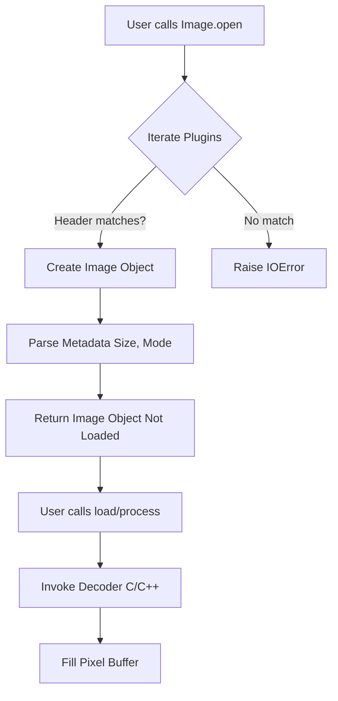

# PIL (Pillow) Image Reading Architecture

## Overview
Python's Pillow (fork of PIL) library uses a **Decoder Factory** pattern combined with **Lazy Loading** to efficiently handle image files. The primary entry point is `Image.open()`.

## Core Mechanisms

### 1. Decoder Factory & Plugins
PIL does not hardcode support for every format in the main `Image` class. Instead, it uses a plugin system:
- **Registry:** Decoders (plugins) register themselves with the PIL framework.
- **Identification:** Each decoder provides an `_accept` function or defines magic numbers. When `Image.open(filename)` is called, PIL iterates through registered plugins, reading the first prefix block (usually 16-1024 bytes) of the file.
- **Selection:** The first plugin that accepts the header is selected as the `Imager` for that file.

### 2. Lazy Loading
`Image.open()` **does not read the pixel data** immediately.
- It parses the file header to extract metadata:
    - Dimensions (`width`, `height`)
    - Mode (`RGB`, `L`, `CMYK`, etc.)
    - Format (`PNG`, `JPEG`, etc.)
- The file handle is kept open (or reopened later).
- Pixel data is only decoded when:
    - `image.load()` is explicitly called.
    - An operation needing data (e.g., `crop`, `resize`, `save`) is performed.
    - The image is converted to a NumPy array.

This allows operations like "get image size" to be extremely fast even for multi-gigabyte files.

### 3. Tile-Based Decoding
PIL decodes images using "tiles".
- A tile is a region of the image (often the whole image, but can be strips or blocks) associated with a decoder (e.g., `raw`, `jpeg`, `zip`).
- The `image.map` attribute contains a list of `(decoder_name, box, offset, args)` tuples.
- When `load()` is called, PIL iterates over these tiles and invokes the underlying C-based decoders to fill the image buffer.

## Architecture Diagram

